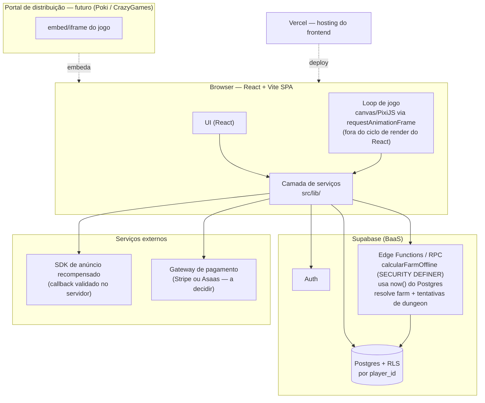

# Arquitetura — visão geral · Autohunt Idle

> Decisão completa (contexto, alternativas, trade-offs) em [ADR-001](../08_DECISOES/adr-001-stack-react-vite-supabase.md). Este documento é o resumo técnico de referência rápida.

## Modelo

**Modelo A — SPA + BaaS** (padrão Kora): React + Vite direto no Supabase, sem API própria. Single-tenant (ver [ADR-002](../08_DECISOES/adr-002-single-tenant.md)) — isolamento por `player_id`, não por `tenant_id`.

## Diagrama de alto nível

## Componentes

| Componente | Responsabilidade |
|---|---|
| UI (React) | Menus, HUD, tela de retorno, configurações — nunca acessa Supabase direto |
| Loop de jogo | Movimento, auto-attack, renderização a 60fps — roda fora do ciclo de render do React |
| Camada de serviços (`src/lib/`) | Único ponto de acesso ao Supabase, ao SDK de anúncio e ao gateway de pagamento |
| Supabase Auth | Cadastro/login, inclui campo de data de nascimento (gate 18+) |
| Postgres + RLS | Dados de personagem, inventário, assinatura, estado de farm — isolado por `player_id` |
| RPC `calcularFarmOffline` | Único lugar que calcula recompensa offline; usa `now()` do banco, nunca aceita timestamp do client |
| SDK de anúncio | Créditos de 15min por anúncio assistido, validado via callback no servidor |
| Gateway de pagamento | Cobrança de assinatura — nunca lida com dado de cartão no nosso código |

## Ambientes

- **Dev**: Supabase local ou projeto Supabase de dev separado + Vite dev server
- **Prod**: Vercel (frontend) + projeto Supabase de produção
- CI/CD: a definir — não há pipeline ainda (projeto pré-código)

## O que fica fora daqui

- Schema detalhado de tabelas → `04_MODELAGEM/` (pendente)
- Regras de negócio (fórmula de recompensa, teto por tier) → `03_REGRAS_DE_NEGOCIO/` (pendente) e `specs/game-idle-farm-core.md` (já escrito)
- Plano de segurança completo → `11_SEGURANCA/`
